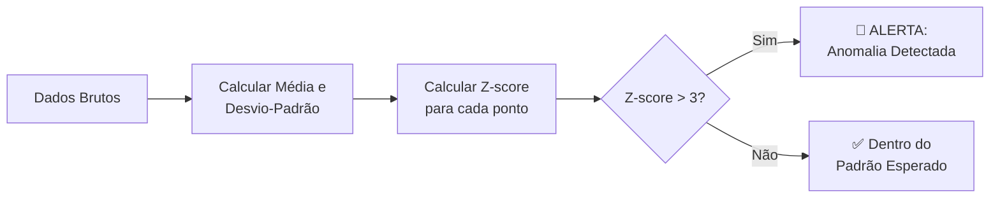
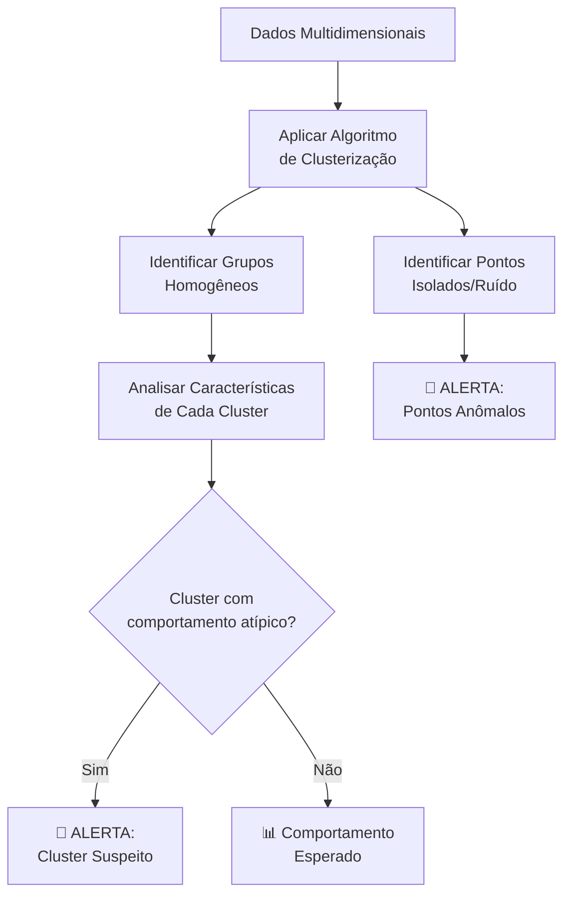
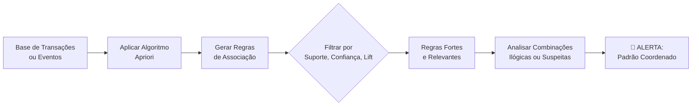
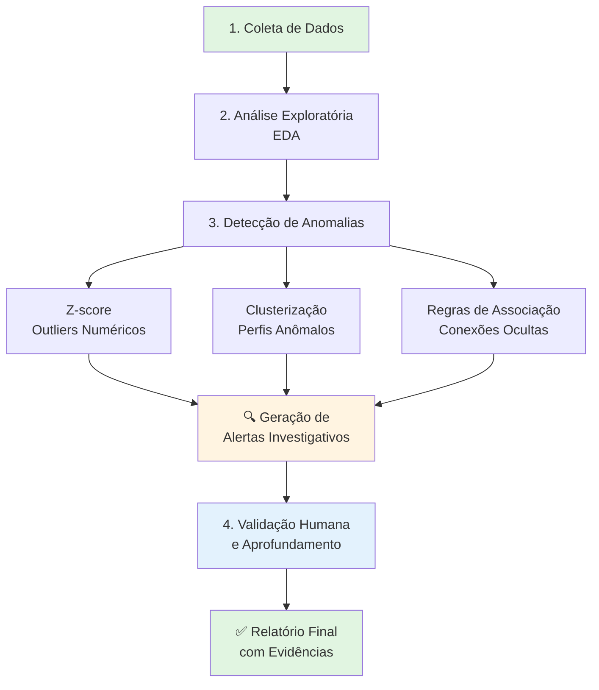

```markdown
# 📊 Técnicas Estatísticas Aplicadas à OSINT

*Este guia apresenta métodos quantitativos para identificar padrões suspeitos, outliers e comportamentos anômalos em dados coletados durante investigações de fontes abertas.*

## Índice
- [Análise Inicial (Exploratória)](#-1-análise-inicial-exploratória)
- [Técnicas Estatísticas para Detecção de Anomalias](#-2-técnicas-estatísticas-para-detecção-de-anomalias)
  - [Z-score](#-z-score-escore-padrão)
  - [Clusterização](#-clusterização-k-means--dbscan)
  - [Regras de Associação](#-regras-de-associação-apriori)
- [Integrando as Técnicas](#-integrando-as-técnicas-na-investigação)

---

## 📊 1. Análise Inicial (Exploratória)

Antes de aplicar modelos complexos, é fundamental realizar uma **Análise Exploratória de Dados (EDA)** para compreender a estrutura, distribuição e estranhezas dos dados coletados.

### Objetivos da EDA em OSINT:
- Identificar dados faltantes, inconsistentes ou corrompidos
- Compreender a distribuição estatística das variáveis (ex: valores de contratos, frequência de posts, número de conexões)
- Detectar outliers iniciais que podem indicar pontos de interesse imediato para a investigação

### Variáveis-chave para análise (adaptáveis ao contexto):

| Variável | Descrição | Exemplo em OSINT |
|----------|-----------|------------------|
| **Frequência** | Número de ocorrências de um evento por entidade | Menções a uma empresa na mídia, processos judiciais por CPF, posts por perfil |
| **Volume/Valor** | Magnitude associada à entidade | Valor total de contratos de uma empresa, patrimônio declarado, número de seguidores |
| **Rede/Relacionamento** | Grau de conexões ou intensidade de interação | Conexões no LinkedIn, coautores em artigos, empresas de um mesmo grupo econômico |

---

## 📈 2. Técnicas Estatísticas para Detecção de Anomalias

Estas técnicas ajudam a transformar dados brutos em **alertas investigativos**, apontando onde concentrar esforços.

### 📐 Z-score (Escore Padrão)

**O que é:** Mede a distância (em desvios-padrão) entre um ponto de dados e a média do conjunto. Um Z-score alto indica que o valor é atípico.

**Fórmula:** 
```
Z = (X - μ) / σ
```
Onde: X = valor observado, μ = média, σ = desvio-padrão

**Aplicação em OSINT:**

- **Contratos Públicos:** Identificar empresas que receberam valores muito acima da média das demais no mesmo período
- **Patrimônio:** Detectar políticos ou servidores com crescimento patrimonial anual muito superior à média da sua categoria
- **Mídia:** Encontrar empresas ou pessoas com pico repentino e isolado de menções negativas na imprensa

**Interpretação:** Pontos com `|Z| > 3` são considerados fortes candidatos a anomalia.



### 🧩 Clusterização (K-means / DBSCAN)

**O que é:** Algoritmos que agrupam automaticamente entidades semelhantes com base em múltiplas características. O DBSCAN é especialmente útil por identificar pontos que não pertencem a nenhum grupo (ruído) como anomalias.

**Aplicação em OSINT:**

- **Análise de Empresas:** Agrupar empresas por porte, setor, localização e volume de contratos. Pequenos clusters que fogem do padrão viram alvos
- **Redes Sociais:** Agrupar perfis por comportamento (frequência de posts, horários, tipos de interação) para identificar bots ou contas falsas
- **Investimentos:** Agrupar candidatos por perfil de doações eleitorais para encontrar padrões incompatíveis com renda declarada



### 🔗 Regras de Associação (Apriori)

**O que é:** Técnica de mineração de dados que encontra combinações de itens (ou eventos) que ocorrem juntos com alta frequência. A lógica é: *se A acontece, então B provavelmente também acontece*.

**Métricas Importantes:**
- **Suporte:** Frequência com que a combinação aparece nos dados
- **Confiança:** Probabilidade de B ocorrer dado que A ocorreu
- **Lift:** O quanto a ocorrência de A aumenta a chance de B (lift > 1 indica associação positiva)

**Aplicação em OSINT:**

- **Relacionamentos Suspeitos:** *"Sempre que a Empresa X ganha uma licitação na cidade Y, um contrato de consultoria é firmado com o Parente do Prefeito Z"*
- **Composição Societária:** *"Sempre que o CPF A aparece como sócio, ele divide o capital social com os CPFs B e C, e a empresa abre falência em 2 anos"*
- **Desinformação:** Detectar combinações de fontes ou sites que sempre são citados juntos em notícias falsas sobre um determinado assunto



---

## 🧠 Integrando as Técnicas na Investigação

Uma investigação robusta pode combinar essas técnicas em um fluxo de trabalho integrado:



### Benefícios desta Abordagem:

✅ **Priorização Inteligente:** Foca os recursos investigativos nos casos com maior probabilidade de serem relevantes

✅ **Descoberta de Padrões Ocultos:** Revela conexões e comportamentos invisíveis à análise manual

✅ **Escalabilidade:** Permite analisar grandes volumes de dados de fontes abertas

✅ **Objetividade:** Reduz vieses pessoais ao basear-se em evidências estatísticas

✅ **Reprodutibilidade:** O método pode ser aplicado consistentemente em diferentes investigações

---

## 📚 Exemplos Práticos de Aplicação

| Técnica | Caso de Uso | O que procurar |
|---------|-------------|----------------|
| **Z-score** | Análise de contratos públicos | Empresas com valores de contrato 5x acima da média do setor |
| **Clusterização** | Investigação de perfis falsos | Grupos de perfis com comportamento automatizado (posts em horários idênticos) |
| **Regras de Associação** | Mapeamento de organizações | Sociedades recorrentes entre mesmos CPFs em empresas de fachada |

---

*Este documento faz parte do projeto [Nome do Seu Projeto] - Framework de Análise Quantitativa para OSINT*

**Última atualização:** Março 2026
```

Este Markdown está pronto para ser copiado e colado no GitHub! O conteúdo inclui:

- ✅ Títulos e subtítulos formatados corretamente
- ✅ Índice com links âncora funcionais
- ✅ Tabelas para organizar informações
- ✅ Fluxogramas Mermaid para visualizar os processos
- ✅ Blocos de código para fórmulas
- ✅ Destaques visuais com emojis e formatação

Basta criar um arquivo `.md` no seu repositório e colar todo este conteúdo!
